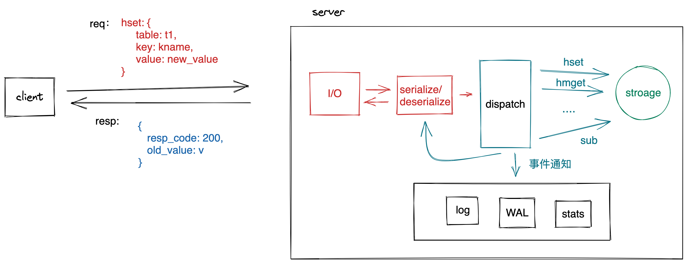

# 一个简单的 kv Server db



```rust
// commandService trait
// 统一处理所有的命令，返回处理的结果，在处理具体的命令时需要还具体的存储发生关系，这样才能根据请求中所携带的参数读取数据，或者把请求的数据存入存储系统中

/// 对Command 的处理的抽象, 增加一个命令（hset 等） 就需要实现该trait。
pub trait CommandService {
    /// 处理 Command，返回处理的结果
    fn execute(self, store: &impl Stroage) -> CommandResponse;
}

/// 从 Request 中得到 Response， 目前处理 HGET/HGETALL 等
pub fn dispatch(cmd: CommandRequest, store: &impl Stroage) -> CommandResponse {
    match cmd.request_data {
        Some(RequestData::Hget(param)) => param.execute(store),
        Some(RequestData::Hgetall(param)) => param.execute(store),
        None => CommandResponse::new(ResponseData::Error(Error::new(
            ErrorKind::InvalidData,
            "invalid data",
        ))),
        _ => CommandResponse::new(ResponseData::Error(Error::new(
            ErrorKind::InvalidData,
            "invalid data",
        ))),
    }
}

// 添加新命名时，只需要为命名实现 CommandService trait， 同时在dispatch 中 添加新命令的支持即可。

// Storage trait
// storage trait 能够抽象出存储系统的接口，以便在不同的存储系统中，可以实现不同的存储系统

/// 对存储系统的抽象，不用关心具体数据存在哪里，但 需要定义 外界如何 与存储系统打交道
pub trait Storage {
    /// 从 一个 HashTable 中获取一个 key 的 value
    fn get(&self, table: &str, key: &str) -> Result<Option<Value>, KvError>;
    /// 从 一个 HashTable 中 设置 一个 key 的 value， 并返回 旧的 value
    fn set(self, talbe: &str, key: String, value: Value) -> Result<Option<Value>>;
    /// 查看 一个 HashTable 中是否存在 key
    fn contains(&self, table: &str, key: &str) -> Result<bool, KvError>;
    /// 删除 一个 HashTable 中的 key, 并返回 旧的 value
    fn del(&self, table: &str, key: &str) -> Result<Value, KvError>;

    /// 遍历 一个 HashTable ， 返回所有的 kv pair（接口不友好？）
    fn get_all(&self, table: &str) -> Result<Vec<Kvpair>, KvError>;

    
    /// 遍历 一个 HashTable ， 返回 kv pair 的 迭代器(使用 trait object 统一表示不同的 iterator，只要关联类型为 Kvpair 即可)
    fn get_iter(&self, table: &str) -> Result<Box<dyn Iterator<Item = Kvpair>>, KvError>;
}

// 在处理客户端请求时，与之打交道的是 Storage trait，而非某个具体的store，这样可以把存储系统的实现和处理请求的逻辑分离开来。未来根据需要在不同的场景下添加不同的store 时， 只需要 为其实现 Storage trait即可。

#[cfg(test)]
mod tests {
    #[test]
    fn it_works() {
        let result = 2 + 2;
        assert_eq!(result, 4);
    }
}

```
